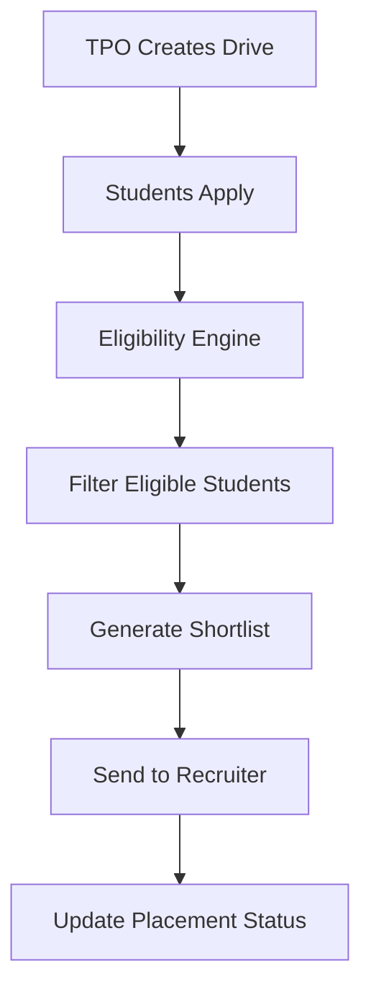

# 🚀 PlacementOS — Placement Eligibility Management System

> Automating campus placement workflows with real-time eligibility tracking, shortlist generation, and analytics.

---

## 📌 About The Project

PlacementOS is a full-stack web application built to solve inefficiencies in campus placement processes at IIIT Ranchi.

It replaces manual spreadsheet-based workflows with an automated system that:

* Tracks student placement status in real-time
* Filters eligible candidates automatically
* Generates recruiter-ready shortlists
* Provides advanced placement analytics

📄 Full PRD: 

---

## ⚡ Problem

Traditional placement workflows suffer from:

* ❌ Incorrect shortlists (placed students included)
* 📉 No centralized data source
* ⏳ Heavy manual effort using Excel sheets
* 🚫 No real-time eligibility tracking

---

## 🎯 Solution

PlacementOS introduces:

* ✅ Centralized placement database
* ✅ Automated eligibility engine
* ✅ One-click shortlist generation
* ✅ Bulk operations & analytics

---

## 🏗️ System Architecture

```
Frontend (React)
       ↓
Backend API (Node.js / Express)
       ↓
PostgreSQL Database
```

---

## 🧩 Features

### 🔹 Core Features

* Student Database (Reg No, Branch, CGPA, Status)
* Placement Status Engine
* Automated Eligibility Filtering
* Recruiter Shortlist Generator

### 🔹 Admin (TPO) Features

* Dashboard (Placed, Unplaced, Active Drives)
* Bulk Status Update via Excel
* Filtered Student Export
* Audit Logs (immutable)
* Manual Status Override

### 🔹 Student Features

* Apply to Drives
* View Eligibility Status
* Track Placement Status
* Application History

---

## 🧠 Advanced Features

### 📌 Lifecycle Management

* Add Individual Student
* Not Interested Status (opt-out system)
* Student Blacklisting

### 📊 Analytics

* Branch-wise Placement Rate (with denominator)
* CTC Analytics (Median, Avg, Highest)
* Company-wise Hiring Distribution

---

## 🔄 Workflow



---

## 🛠️ Tech Stack

| Layer    | Technology       |
| -------- | ---------------- |
| Frontend | React.js         |
| Backend  | Node.js, Express |
| Database | PostgreSQL       |
| Auth     | JWT              |
| Hosting  | Vercel / AWS     |

---

## 📂 Project Structure

```
placementOS/
│── client/          # React frontend
│── server/          # Node.js backend
│── database/        # DB schema & migrations
│── docs/            # PRD & documentation
│── README.md
```

---

## 📊 Key Metrics (Success Criteria)

* 🎯 Incorrect shortlist rate → ~0%
* ⏱️ Manual effort reduced significantly
* ⚡ Bulk updates → minutes instead of hours
* 📈 Real-time placement visibility

---

## 🔐 Non-Functional Requirements

* Role-Based Access Control (Admin, Coordinator, Student)
* High data accuracy & consistency
* Secure authentication (JWT)
* Scalable system design
* Audit logging for all admin actions

---

## 🚀 Getting Started

### Prerequisites

* Node.js (v18+)
* PostgreSQL
* npm / yarn

### Installation

```bash
# Clone the repo
git clone https://github.com/your-username/placementOS.git

# Install dependencies
cd placementOS
npm install

# Setup environment variables
cp .env.example .env

# Run backend
npm run server

# Run frontend
npm run client
```

---

## 🧪 Future Improvements

* Recruiter login portal
* AI-based candidate ranking
* Resume parsing system
* Interview scheduling automation

---

## 🤝 Contributing

Contributions are welcome! Feel free to fork the repo and submit a PR.

---

## 📌 Why This Project Matters

This project demonstrates:

* Real-world product thinking
* Scalable system design
* Data-driven decision making
* End-to-end full-stack execution

💡 Ideal for showcasing in:

* Product Management roles
* Software Engineering roles
* Data/Product Analyst roles

---

## 📄 License

This project is for academic and internal use.

---

## 🙌 Acknowledgements

* Training & Placement Cell — IIIT Ranchi
* Product & Development Team

---
